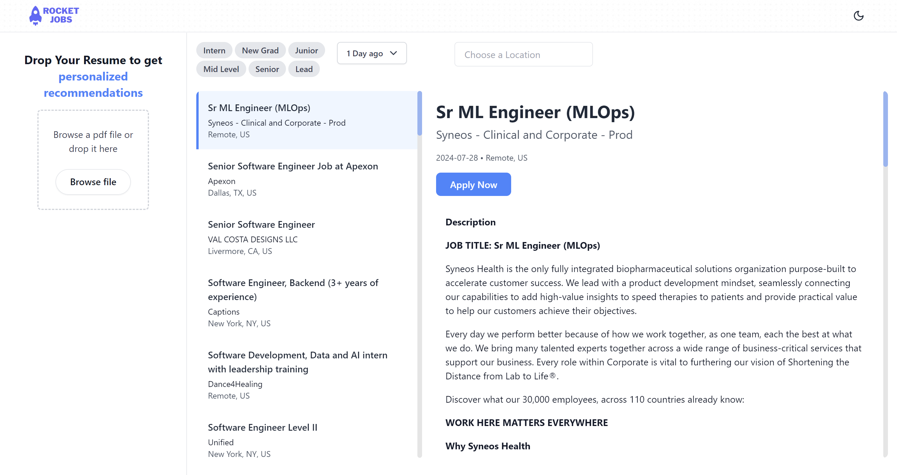

# AI Job Board Recommender

Upload your resume and get jobs tailored to your work



# Running Instruction

```
1. Clone the repository:
   ```
   git clone https://github.com/b-sai/job_board.git
   ```

2. Install dependencies:
   ```
   npm install
   ```


3. Start the development server:
   ```
   npm run dev
   ```

5. Open your browser and navigate to `http://localhost:3000` to view the application.